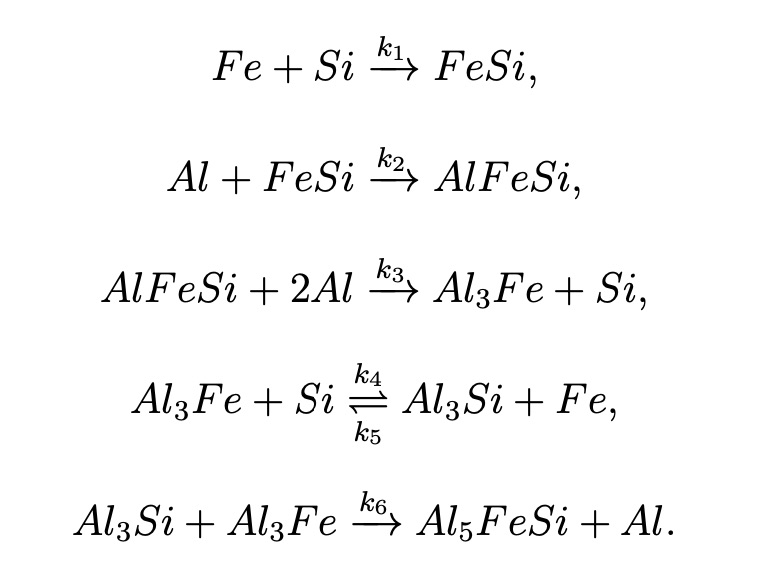

# Stochastic Simulation Algorithm (SSA) for Chemical Reactions

## Overview

This Python script implements a Stochastic Simulation Algorithm (SSA) for modeling chemical reactions. It's designed to simulate the time evolution of a system of chemical species undergoing a set of reactions, taking into account the stochastic nature of chemical processes at the molecular level.

## Features

- Simulates multiple chemical species (A, B, C, P, Aj, Bj, Cj, D)
- Implements temperature-dependent reaction rates using the Arrhenius equation
- Handles multiple reaction channels
- Made for heterogeneous reactions
- Allows for multiple simulation runs
- This python script is configurated to run the simulation of the AA8011 alloy reaction methods 
- 

## Requirements

- Python 3.x
- NumPy
- Pandas

## Usage

1. Import the `SSA` class from the script:

   ```python
   from ssa_simulation import SSA
   ```

2. Set up the simulation parameters:

   ```python
   params = {
       'k1': 1e-4, 'k2': 8e-6, 'k3': 1e-11, 'k4': 6e-5, 'k5': 3e-4, 'k6': 4e-4,
       'A0': 1000, 'B0': 1000, 'C0': 2000, 'Cj0': 0, 'P0': 0, 'T0': 50,
       'E1': 363, 'E2': 363, 'E3': 363, 'E4': 363, 'E5': 363, 'E6': 363,
       'beta': 10, 'q': 1.5, 'Nc': 10000, 'shape': 1000
   }
   ```

3. Create an instance of the SSA class:

   ```python
   ssa = SSA(params)
   ```

4. Run the simulation and get the results:

   ```python
   results = ssa.organize()
   ```

5. Analyze the results using pandas DataFrame operations.

## Parameters

- `k1` to `k6`: Reaction rate constants
- `A0`, `B0`, `C0`, `Cj0`, `P0`: Initial number of particles for each species
- `T0`: Initial temperature
- `E1` to `E6`: Activation energies for reactions
- `beta`: Temperature increase rate
- `q`: Heterogeneity parameter
- `Nc`: Number of simulation runs
- `shape`: Number of steps in each simulation run

## Output

The `organize()` method returns a pandas DataFrame containing the time evolution of all species concentrations, temperature, reaction propensities, and other relevant data for each simulation run.

## Notes

- The simulation uses the Gillespie algorithm to determine the time and nature of each reaction event.
- The code implements temperature-dependent reaction rates and heterogeneous reactions.
- Multiple runs can be performed to account for the stochastic nature of the process.

## License

This project is licensed under the MIT License:

MIT License

Copyright (c) 2024 Juan Daniel Galindo González

Permission is hereby granted, free of charge, to any person obtaining a copy
of this software and associated documentation files (the "Software"), to deal
in the Software without restriction, including without limitation the rights
to use, copy, modify, merge, publish, distribute, sublicense, and/or sell
copies of the Software, and to permit persons to whom the Software is
furnished to do so, subject to the following conditions:

The above copyright notice and this permission notice shall be included in all
copies or substantial portions of the Software.

THE SOFTWARE IS PROVIDED "AS IS", WITHOUT WARRANTY OF ANY KIND, EXPRESS OR
IMPLIED, INCLUDING BUT NOT LIMITED TO THE WARRANTIES OF MERCHANTABILITY,
FITNESS FOR A PARTICULAR PURPOSE AND NONINFRINGEMENT. IN NO EVENT SHALL THE
AUTHORS OR COPYRIGHT HOLDERS BE LIABLE FOR ANY CLAIM, DAMAGES OR OTHER
LIABILITY, WHETHER IN AN ACTION OF CONTRACT, TORT OR OTHERWISE, ARISING FROM,
OUT OF OR IN CONNECTION WITH THE SOFTWARE OR THE USE OR OTHER DEALINGS IN THE
SOFTWARE.

## Contact

If you need more information about this work you can contact me at contact@gdanilo.com